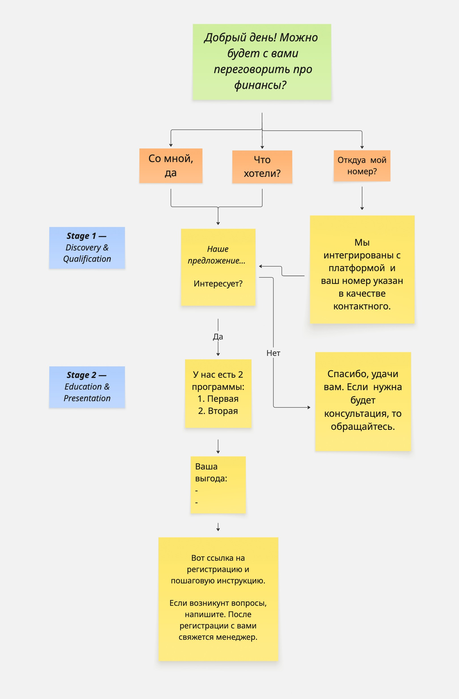
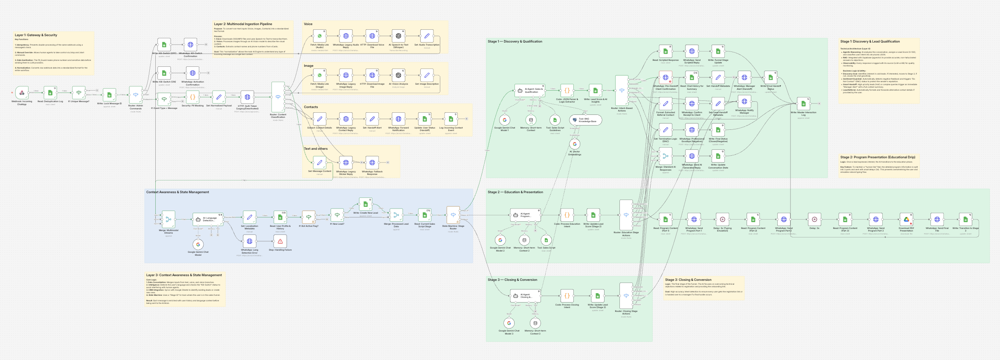
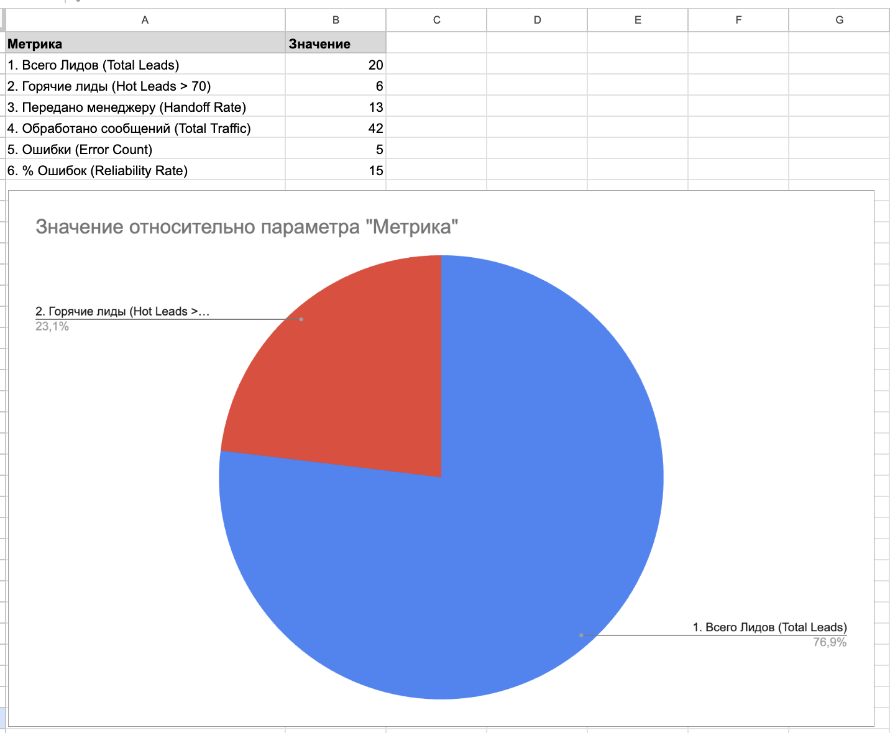

# ИИ-ассистент продаж и квалификации лидов (WhatsApp / n8n)

*🇺🇸 [English Version](README.md)*

> **Позиционирование:** Production-ready WhatsApp ассистент продаж. Ведет диалог по жесткому скрипту (State Machine), отрабатывает возражения через векторную базу знаний (RAG), квалифицирует лидов (Lead Scoring), делает follow-up и бесшовно передает диалог менеджеру. Система устойчиво работает за счет дедупликации вебхуков, retry-политик и централизованной обработки ошибок (DLQ).

## Контекст проекта и статус
- **Статус:** MVP успешно сдан и протестирован (Входящие события → ИИ-диалог + RAG → Эскалация / Follow-up). В данный момент проект поставлен на паузу со стороны клиента из-за пересмотра внутренних бюджетов.
- **Кросс-функциональное взаимодействие:** Работала в тесной связке с командой разработчиков клиента: проектировала и согласовывала API-контракты интеграции и форматы Webhook payload-ов.
- **Деплой:** Файл [/docker/docker-compose.yml](/docker/docker-compose.yml) отражает спроектированный «следующий шаг» для развертывания системы на On-Premise инфраструктуре заказчика.

---

## Архитектура системы

Проект построен как модульный, событийно-ориентированный пайплайн (Event-driven pipeline) на базе **n8n**. 

*Визуализация бизнес-логики и машины состояний.*

**Реальный пайплайн n8n:**

*Производственный n8n-воркфлоу с мультимодальной обработкой, RAG и изолированными этапами стейт-машины.*

### Ключевые бизнес-функции
| Функция | Описание |
| :--- | :--- |
| 1. **Маршрутизация (State Machine)** | Лиды строго ведутся по воронке продаж (`Discovery` -> `Education` -> `Closing`) к самостоятельной регистрации. При отклонении от темы ИИ отрабатывает запрос и плавно возвращает клиента обратно в скрипт. |
| 2. **База знаний (RAG)** | Интеграция с **Supabase (pgvector)** для динамического поиска официальных ответов компании и отработки возражений (снижает риск галлюцинаций LLM). |
| 3. **Мультимодальность** | Нативная обработка голосовых сообщений (Speech-to-Text через Whisper), изображений (Vision AI) и отправленных контактов (vCard) с приведением всего к единому текстовому контексту для ИИ. |
| 4. **Умный скоринг лидов** | LLM оценивает намерения пользователя, выдает оценку от 0 до 100 и классифицирует теплоту лида (Cold/Warm/Hot) напрямую в CRM. |
| 5. **Пакетная аналитика (Batch Analytics Worker)** | Отдельный воркфлоу по расписанию агрегирует логи чатов и с помощью ИИ генерирует инсайты (точки отвала, топ возражений, триггеры успешных конверсий). |
| 6. **Автоматический Follow-up** | Бот самостоятельно возвращает к диалогу пользователей, которые молчат более 24 часов, повышая итоговую конверсию. |
| 7. **No-Code CMS** | Тексты скриптов вынесены в Google Таблицы, что позволяет бизнесу редактировать реплики бота в реальном времени без вмешательства в код. |
| 8. **Защита от блокировок** | Мгновенно распознает негатив или просьбы отписаться, переводя лид в статус Do Not Contact, что предотвращает бан номера WhatsApp. |

**Дашборд бизнес-аналитики:**

---

## Инженерные практики и надежность
В архитектуру заложены production-ready паттерны, гарантирующие отказоустойчивость и стабильную работу системы под нагрузкой:

*   **Идемпотентность и Дедупликация:** Вебхуки проверяются по базе `processed_events` с использованием уникальных `messageId`. Дублирующиеся события отсекаются на входе (Drop).
*   **Глобальный Error Handler (DLQ):** Любая необработанная ошибка в системе триггерит Dead Letter Queue воркфлоу, записывает точное место сбоя в лог и отправляет алерт дежурному админу в Telegram.
*   **Отказоустойчивость API:** Все внешние запросы (LLM, БД) используют Exponential Backoff (настроены Retries) для защиты от rate limits (`HTTP 429`) и временных сбоев сети.
*   **Безопасность и PII Маскирование:** Выделенная нода `PII_Guard` перехватывает данные, маскирует номера телефонов и удаляет номера банковских карт ДО того, как они попадут в логи или отправятся в LLM.
*   **Human-in-the-Loop (Kill-Switch):** Менеджер может перехватить любой чат командой `/stop`, что физически блокирует способность ИИ отвечать данному лиду.
*   **Версионирование промптов:** Системные инструкции (System Prompts) вынесены из логических нод и версионируются как Markdown-файлы (см. папку [`/prompts/`](/prompts/)).
*   **Наблюдаемость:** Структурированное логирование всех этапов исполнения в Google Sheets (`processed_events`, `dead_letters`) с привязкой к `execution_id` и отслеживанием источника ответов (rag_source: LLM или База Знаний) для контроля качества.

---

## Структура репозитория

### Воркфлоу (n8n JSON)
| Файл | Описание |
| :--- | :--- |
| [00_rag_data_ingestion.json](00_rag_data_ingestion.json) | **Подготовка данных.** Векторизация базы знаний и загрузка в Supabase (pgvector). |
| [01_core_ai_sales_agent.json](01_core_ai_sales_agent.json) | **Мозг системы.** Основная логика: State machine, маршрутизация ИИ, RAG и эскалации. |
| [02_retention_followup_worker.json](02_retention_followup_worker.json) | **Дожим.** Ежедневный запуск для возврата лидов, которые молчат более 24 часов. |
| [03_batch_insights_analyst.json](03_batch_insights_analyst.json) | **Аналитика.** Сбор логов и LLM-анализ точек отвала и возражений. |
| [90_test_mock_provider.json](90_test_mock_provider.json) | **Инструмент QA.** Симулятор входящих сообщений WhatsApp (Текст, Голос, Контакты) для тестов. |
| [99_global_incident_handler.json](99_global_incident_handler.json) | **DLQ.** Глобальный перехватчик ошибок: запись в лог и отправка алертов в Telegram. |

### Документация (`/docs`)
* 📄 [ARCHITECTURE.md](./docs/ARCHITECTURE.md) — Компоненты системы, поток данных и машина состояний.
* 🔌 [Integrations & API](./docs/integrations.md) — Контракты вебхуков и форматы JSON payload-ов.
* 🔒 [Security](./docs/security.md) — Управление секретами, маскирование PII данных и guardrails.
* 📖 [Runbook](./docs/RUNBOOK.md) — Руководство по устранению сбоев и матрица edge-кейсов.
* 🧪 [Test Scenarios](./docs/TEST_SCENARIOS.md) — Тестовые сценарии (обработка RAG, негатива, перевод на менеджера).
* 🚀 [Deployment](./docs/DEPLOYMENT.md) — Инфраструктура и стратегия деплоя.

### Медиа (`/assets`)
* 🗺️ [00_system_architecture_diagram.jpg](./assets/00_system_architecture_diagram.jpg) — Схема логики из Miro.
* 📊 [01_metrics_dashboard.png](./assets/01_metrics_dashboard.png) — Дашборд аналитики.
* 🗄️ [02_supabase_pgvector.png](./assets/02_supabase_pgvector.png) — Структура векторной БД (RAG).
* 📝 [03_scripts_db.png](./assets/03_scripts_db.png) — Тексты скриптов.
* 📝 [04_crm_db.png](./assets/04_crm_db.png) — CRM в Google Таблицах.

---

## Как запустить и протестировать (Demo)

Система спроектирована независимо от конкретного WhatsApp-провайдера (Provider-agnostic), поэтому логику можно тестировать без реального подключения к номеру телефона:

1. Импортируйте JSON воркфлоу в ваш инстанс n8n.
2. Настройте credentials (или используйте mock-данные), опираясь на файл [.env.example](/.env.example).
3. Откройте воркфлоу **[90_test_mock_provider.json](/90_test_mock_provider.json)**.
4. Скопируйте любой JSON-payload из папки [`/fixtures/`](/fixtures/) в ноду HTTP Request и выполните запуск.
5. Откройте **[01_core_ai_sales_agent.json](01_core_ai_sales_agent.json)**, чтобы наблюдать за маршрутизацией State Machine, работой RAG и парсингом JSON-ответов от ИИ.

---

### 👤 Автор

**Гульназ Бакинова**

*Инженер по интеграциям и автоматизации (n8n / Low-code)*

Будем на связи!
[LinkedIn](https://www.linkedin.com/in/gulnaz-bakinova/)

*Этот репозиторий опубликован только для портфолио и демонстрации*
